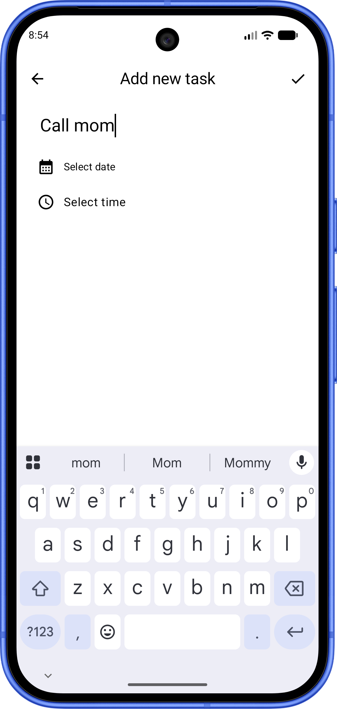

#  AsirTasks

  

##  Live Link

Check out Periodic Table in action: [Live on Play Store](https://play.google.com/store/apps/details?id=com.asiradnan.asirtasks)

## Overview

The Android client for Asir Tasks (https://tasks.asiradnan.com), built with Kotlin and Jetpack Compose. Manage tasks offline with a local Room database, and sync in the background with the shared FastAPI backend whenever you're online.

## Features

- **Offline-First:** Tasks are stored locally in a Room database and work fully without internet.
- **Background Sync:** Automatically syncs with the backend when connectivity is restored.
- **Reminders:** Schedule alarm-based notifications for upcoming tasks, with boot-persistence.
- **Authentication:** Secure login with automatic token refresh.
- **Sync Status Indicators:** Clear UI showing whether a task is saved locally or synced.
- **Dark Mode:** Supports light and dark themes.

## Tech Stack

- **Language:** Kotlin
- **UI Toolkit:** Jetpack Compose
- **Local Storage:** Room Database
- **Background Work:** WorkManager
- **Min SDK:** 29 · **Target SDK:** 37
- **Build Tool:** Gradle (Kotlin DSL)

## License

This project is open source under the **MIT License**.